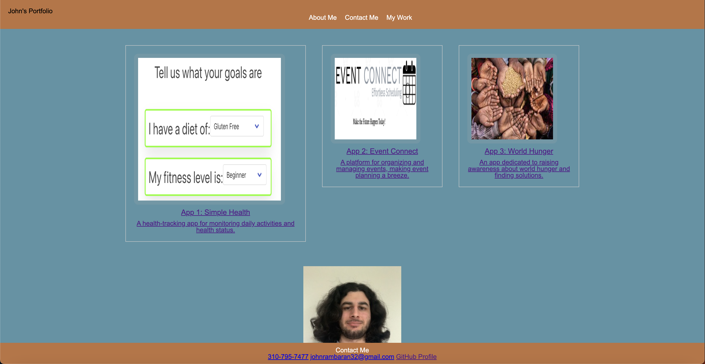

# Professional-Portfolio

## Description

This is my first website that I built out, and my motivation was to have an early prototype of my portfolio. This has a list of my projects that I have worked on, and will include many more as I update it. I learned how to apply css as well as make a basic html webpage.

## Installation

N/A

## Usage

The webpage can be located at https://johna98.github.io/Professional-Portfolio/. You can click on the items in the navbar at the top of the screen to be directed to that part of the page. You can also click on the pictures to view my projects that I have worked on.

## Credits

N/A

## License

Please refer to the LICENSE in the repo.